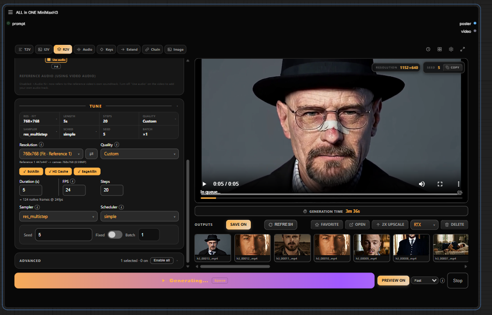
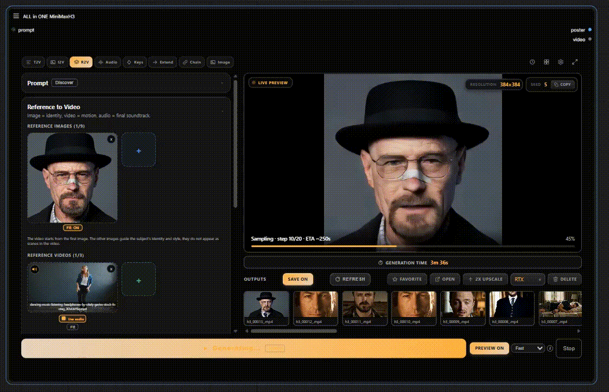
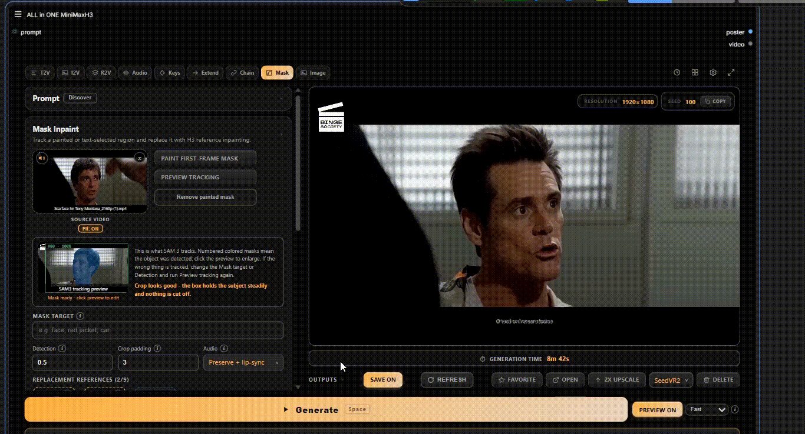
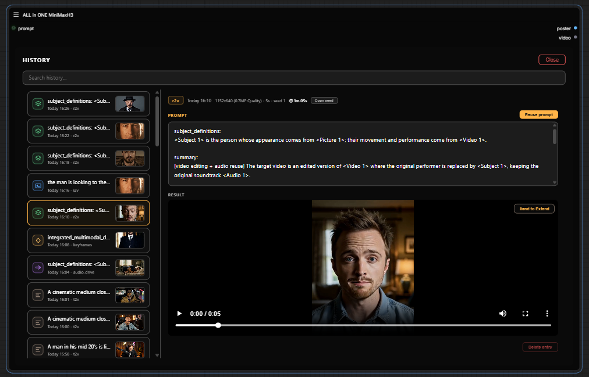
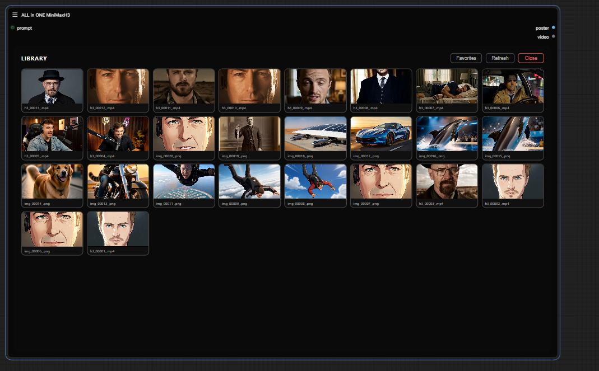
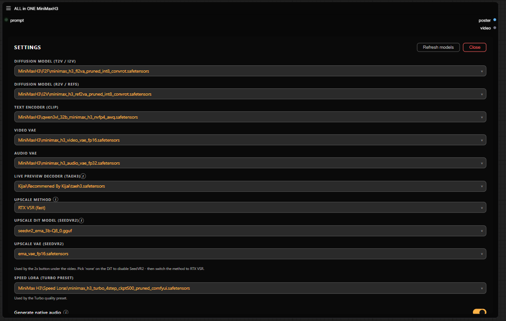

# ComfyUI ALL-in-ONE MiniMax H3


One node. The whole MiniMax H3 video pipeline.

No node graph to build, no wires to connect, no hunting through twelve custom node packs to figure out which workflow is the right one. Pick a mode, drop in your prompt or references, hit **Generate** — the node does the rest.
## Modes

| Mode | What it does |
|------|--------------|
| **Image** | Still images with H3: text to image, image edit, or reference mix (up to 9 references) via H3 Studio |
| **T2V** | Text to video with native audio (fl2va model) |
| **I2V** | Animate a start frame, optionally morph to an end frame |
| **R2V** | Reference images / videos / audio drive the clip (ref2va model) |
| **Character Sheet** | Turn up to 9 reference images of one character into a stitched turnaround sheet (6-panel full orbit or a faster 4-panel version) |
| **Audio Drive** | Your audio track is the soundtrack, and it drives mouth movement (lip sync) |
| **Keyframes** | Pin still images at arbitrary frame positions |
| **Extend** | Continue an existing video seamlessly |
| **Chain** | Multi-clip continuation with H3 Motion Context (latent path, no re-encode) |
| **Mask** | Paint or describe a region in a video, track it, and replace only that area |
| **Upscale** | RTX/Seed2VR Video Super Resolution hook |

In Mask mode, painting a region and describing it with text are two separate paths. In my testing, mixing manual inpainting with a text prompt does not work well, so pick one approach per mask.

## Compare & Stitch

Pick 2-4 outputs from the Library or the outputs strip and open **Compare & Stitch**. The Compare tab plays every clip side by side in sync, and the Stitch tab exports them as one side-by-side clip: deterministic frame matching at 24 fps, spacing and gutter color, per-clip trim, and h264 or h265/mp4 output. Audio comes from clip 1. Needs only ComfyUI VideoHelperSuite, which the node already lists below.

## Screenshots

**Modes** — switch between modes, R2V, T2V, T2I, I2V, Audio Drive, Keyframes, Extend, Chain.



**Live Preview** — live preview of your video while sampling.



**Masking** — paint or describe a region, track it, and replace only that area.



**History** — searchable, with prompt reuse and per-entry preview.



**Library** — every output in one place: inline preview, favorites, open-folder, delete, RTX upscale hook.



**Settings** — theme accent, sounds, models.



## Requirements

T2V, I2V and R2V run on ComfyUI core alone. Everything else you might need, every model and every optional custom node pack, is listed in **[requirements/REQUIREMENTS.md](requirements/REQUIREMENTS.md)**.

The optional **SLA Draft** quality preset is a fast prompt-tweak mode that needs the [ComfyUI-PlagueKind-Nodes](https://github.com/PlagueKind/ComfyUI-PlagueKind-Nodes) pack. It is off by default.

## Installation

```bash
# inside ComfyUI/custom_nodes/
git clone https://github.com/LeonQ8/ComfyUI-ALLinONE-MinimaxH3.git
```

Restart ComfyUI, then double-click the canvas and search for **ALL in ONE MiniMaxH3**.

## Compatibility

I develop and test against a pinned stack (ComfyUI version, custom node commits, model files). It's all listed in **[COMPATIBILITY.md](COMPATIBILITY.md)**, if a render fails after you updated something, start there.

## Contributing

Contributions are welcome: bug fixes, compatibility improvements, and useful enhancements.

Before opening a pull request, please read [CONTRIBUTING.md](CONTRIBUTING.md).

## Credits

- The "one node" idea and UI approach: Ján — [one-node-flux-2-klein](https://github.com/yanokusnir-ai/one-node-flux-2-klein) and [one-node-gemma-4](https://github.com/yanokusnir-ai/one-node-gemma-4)
- Chain / Keyframes / Extend wiring: [ComfyUI-H3-Motion-Context-MultiRef](https://github.com/seitanism/ComfyUI-H3-Motion-Context-MultiRef) by seitanism
- Base graphs: the official MiniMax H3 native workflows from Comfy-Org
- Turbo preset: ComfyUI-MiniMax-H3-Turbo pack
- Image mode: [ComfyUI-MiniMax-H3-Studio](https://github.com/thaakeno/ComfyUI-MiniMax-H3-Studio) by thaakeno
- Mask mode crop and latent-mask nodes: [MaskVidExperiments](https://github.com/drozbay/MaskVidExperiments) by drozbay
- Character Sheet mode: [H3 Character Sheet Generator](https://huggingface.co/PoopMan333/H3_Character_Sheet_Generator) by PoopMan333

## Support

This node is in **beta** — if something breaks, please [open an issue](https://github.com/LeonQ8/ComfyUI-ALLinONE-MinimaxH3/issues), it's the fastest way to get it fixed.

If you like this node and it saves you a few hours of graph surgery, a coffee is always appreciated.<3

<a href="https://ko-fi.com/leonq8" target="_blank"></a>

## License

GPL-3.0 — see [LICENSE](LICENSE).
