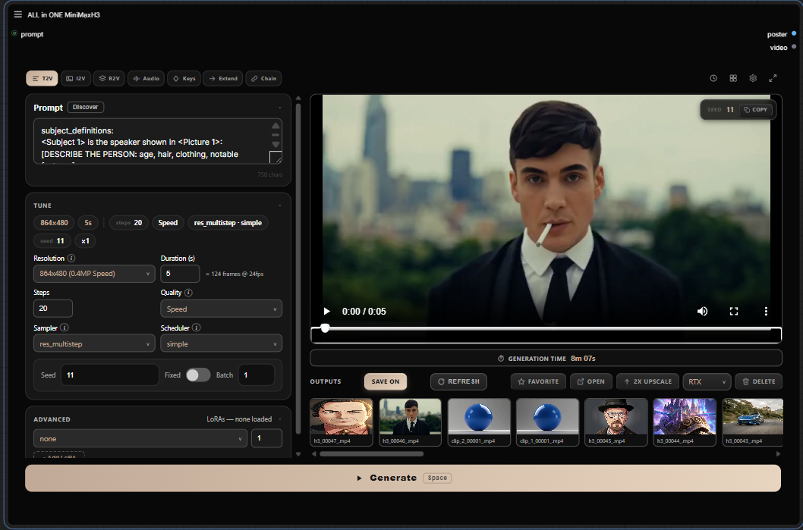
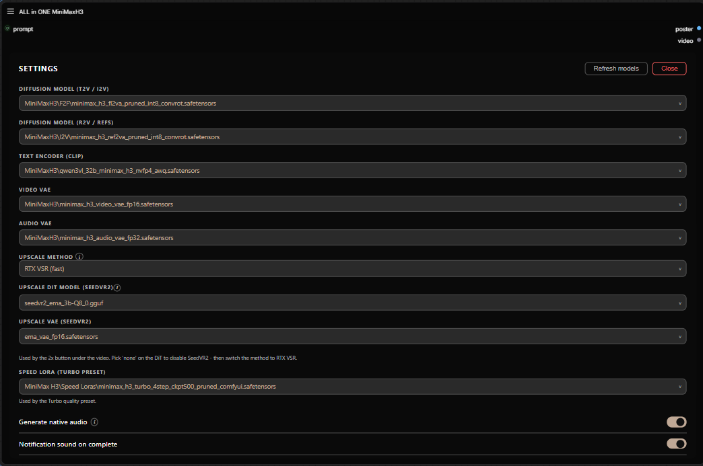

# ComfyUI ALL-in-ONE MiniMax H3


One node. The whole MiniMax H3 video pipeline.

No node graph to build, no wires to connect, no hunting through twelve custom node packs to figure out which workflow is the right one. Pick a mode, drop in your prompt or references, hit **Generate** — the node does the rest.



## Modes

| Mode | What it does |
|------|--------------|
| **T2V** | Text to video with native audio (fl2va model) |
| **I2V** | Animate a start frame, optionally morph to an end frame |
| **R2V** | Reference images / videos / audio drive the clip (ref2va model) |
| **Audio Drive** | Your audio track is the soundtrack, and it drives mouth movement (lip sync) |
| **Keyframes** | Pin still images at arbitrary frame positions |
| **Extend** | Continue an existing video seamlessly |
| **Chain** | Multi-clip continuation with H3 Motion Context (latent path, no re-encode) |
| **Upscale** | RTX/Seed2VR Video Super Resolution hook |

## Screenshots

**History** — searchable, with prompt reuse and per-entry preview.


**Library** — every output in one place: inline preview, favorites, open-folder, delete, RTX upscale hook.


**Settings** — theme accent, sounds, models.



## Requirements

### Models

Official MiniMax H3 files from [Comfy-Org/MiniMax-H3](https://huggingface.co/Comfy-Org/MiniMax-H3), placed in your standard `ComfyUI/models/` folders:

| File | Folder |
|------|--------|
| `minimax_h3_fl2va_pruned_int8_convrot.safetensors` | `diffusion_models/` |
| `minimax_h3_ref2va_pruned_int8_convrot.safetensors` | `diffusion_models/` |
| `qwen3vl_32b_minimax_h3_nvfp4_awq.safetensors` | `text_encoders/` |
| `minimax_h3_video_vae_fp16.safetensors` | `vae/` |
| `minimax_h3_audio_vae_fp32.safetensors` | `vae/` |

### Custom nodes

- **Chain / Keyframes / Extend modes:** [ComfyUI-H3-Motion-Context-MultiRef](https://github.com/seitanism/ComfyUI-H3-Motion-Context-MultiRef)
- **Audio Drive mode:** comfyui-vrgamedevgirl
- **Turbo preset:** [ComfyUI-MiniMax-H3-Turbo](https://github.com/Larryvrh/ComfyUI-MiniMax-H3-Turbo) + a turbo LoRA from [larryvrh/MiniMax-H3-Turbo-Lora](https://huggingface.co/larryvrh/MiniMax-H3-Turbo-Lora) (recommended: `minimax_h3_turbo_v4_step600_ema.safetensors`)
- **Optional (used by Speed / High Quality presets):** ComfyUI-SolAttn_triton, ComfyUI-MiniMaxH3-Cache, SageAttention

Exact tested versions of everything are in **[COMPATIBILITY.md](COMPATIBILITY.md)** — check that file first if something breaks after you update ComfyUI or a pack.

## Installation

```bash
# inside ComfyUI/custom_nodes/
git clone https://github.com/LeonQ8/ComfyUI-ALLinONE-MinimaxH3.git
```

Restart ComfyUI, then double-click the canvas and search for **ALL in ONE MiniMaxH3**.

## Compatibility

I develop and test against a pinned stack (ComfyUI version, custom node commits, model files). It's all listed in **[COMPATIBILITY.md](COMPATIBILITY.md)**, if a render fails after you updated something, start there.

## Credits

- The "one node" idea and UI approach: Ján — [one-node-flux-2-klein](https://github.com/yanokusnir-ai/one-node-flux-2-klein) and [one-node-gemma-4](https://github.com/yanokusnir-ai/one-node-gemma-4)
- Chain / Keyframes / Extend wiring: [ComfyUI-H3-Motion-Context-MultiRef](https://github.com/seitanism/ComfyUI-H3-Motion-Context-MultiRef) by seitanism
- Base graphs: the official MiniMax H3 native workflows from Comfy-Org
- Turbo preset: ComfyUI-MiniMax-H3-Turbo pack

## Support

This node is in **beta** — if something breaks, please [open an issue](https://github.com/LeonQ8/ComfyUI-ALLinONE-MinimaxH3/issues), it's the fastest way to get it fixed.

If you like this node and it saves you a few hours of graph surgery, a coffee is always appreciated.<3

<a href="https://ko-fi.com/leonq8" target="_blank"></a>

## License

GPL-3.0 — see [LICENSE](LICENSE).
